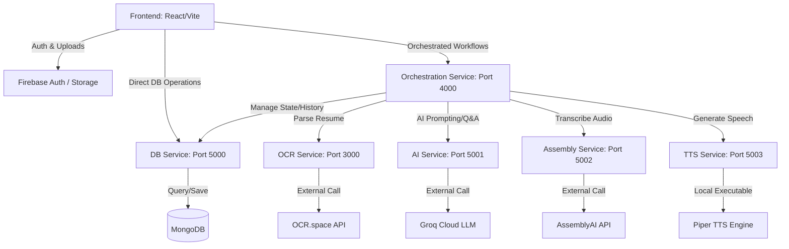

# PrepView 2.0 🚀

PrepView 2.0 is a state-of-the-art, AI-powered mock interview preparation web application. It simulates real-world technical and behavioral interview experiences, providing candidates with dynamic questions, voice-based or text-based conversational loops, and detailed post-session evaluations.

---

## 🏗️ System Architecture

PrepView is designed using a microservices-based architecture to decouple compute-intensive AI operations, transcription, text-to-speech synthesis, and database operations.



### Microservices Directory

| Service | Port | Directory | Purpose |
| :--- | :--- | :--- | :--- |
| **Frontend** | `5173` | [`Frontend`](file:///home/adhiraj-pal/Downloads/prepview-2.0/Frontend) | React client dashboard, interactive interview portal, and analytics. |
| **Orchestration Gateway** | `4000` | [`Backend/Orchestration_service`](file:///home/adhiraj-pal/Downloads/prepview-2.0/Backend/Orchestration_service) | Coordinates downstream API requests and aggregates responses. |
| **OCR Service** | `3000` | [`Backend/OCR_Service`](file:///home/adhiraj-pal/Downloads/prepview-2.0/Backend/OCR_Service) | Extracts text from uploaded PDF/text resumes via OCR.space. |
| **DB Service** | `5000` | [`Backend/DB_service`](file:///home/adhiraj-pal/Downloads/prepview-2.0/Backend/DB_service) | Connects to MongoDB to manage users, sessions, and transcripts. |
| **AI Service** | `5001` | [`Backend/AI_service`](file:///home/adhiraj-pal/Downloads/prepview-2.0/Backend/AI_service) | Generates dynamic interview questions/feedback using Groq (Llama). |
| **Assembly Service** | `5002` | [`Backend/Assembly_service`](file:///home/adhiraj-pal/Downloads/prepview-2.0/Backend/Assembly_service) | Transcribes candidate speech to text using AssemblyAI. |
| **TTS Service** | `5003` | [`Backend/tts_service`](file:///home/adhiraj-pal/Downloads/prepview-2.0/Backend/tts_service) | Synthesizes realistic audio feedback using a local Piper TTS engine. |

---

## 🛠️ Prerequisites

Before running the application, make sure you have the following installed:

- **Node.js** (v18.0.0 or higher) & **npm**
- **MongoDB** (Running locally on `mongodb://127.0.0.1:27017` or a MongoDB Atlas cloud instance connection string)
- **Nodemon** (For local development auto-reloads. Install globally with: `npm install -g nodemon`)
- **Docker & Docker Compose** (Optional, if you wish to run the entire stack in containers)

### 🔑 External APIs & Service Accounts
You will need API keys or setup details from the following platforms:
1. **Groq Cloud API Key**: For AI question and feedback generation.
2. **AssemblyAI API Key**: For candidate audio transcription.
3. **OCR.space API Key**: For resume parsing.
4. **Firebase Project Configuration**: Firebase is used for authentication and web storage. Set up a Web App in your Firebase console.

---

## ⚙️ Environment Configuration

You must create and populate `.env` files for the Frontend and individual Backend services. Follow the templates below:

### 1. Frontend Configuration
Create a `.env` file under the [`Frontend`](file:///home/adhiraj-pal/Downloads/prepview-2.0/Frontend) folder:
```env
VITE_DB_SERVICE_URL=http://localhost:5000/db
VITE_ORCHESTRATION_SERVICE_URL=http://localhost:4000
VITE_FIREBASE_API_KEY=your_firebase_api_key
VITE_FIREBASE_PROJECT_ID=your_project_id
VITE_FIREBASE_STORAGE_BUCKET=your_storage_bucket
VITE_FIREBASE_AUTH_DOMAIN=your_auth_domain
VITE_FIREBASE_MESSAGING_SENDER_ID=your_messaging_sender_id
VITE_FIREBASE_APP_ID=your_app_id
```

### 2. Backend Services Configuration
Create a `.env` file inside each respective backend service directory:

*   **DB Service** ([`Backend/DB_service/.env`](file:///home/adhiraj-pal/Downloads/prepview-2.0/Backend/DB_service/.env)):
    ```env
    PORT=5000
    Mongodb=mongodb://127.0.0.1:27017
    ```
*   **AI Service** ([`Backend/AI_service/.env`](file:///home/adhiraj-pal/Downloads/prepview-2.0/Backend/AI_service/.env)):
    ```env
    PORT=5001
    groq_api=your_groq_api_key
    ```
*   **Assembly Service** ([`Backend/Assembly_service/.env`](file:///home/adhiraj-pal/Downloads/prepview-2.0/Backend/Assembly_service/.env)):
    ```env
    PORT=5002
    Assembly_api=your_assembly_ai_api_key
    ```
*   **OCR Service** ([`Backend/OCR_Service/.env`](file:///home/adhiraj-pal/Downloads/prepview-2.0/Backend/OCR_Service/.env)):
    ```env
    PORT=3000
    OCR_api_key=your_ocr_space_api_key
    ```
*   **Orchestration Service** ([`Backend/Orchestration_service/.env`](file:///home/adhiraj-pal/Downloads/prepview-2.0/Backend/Orchestration_service/.env)):
    ```env
    PORT=4000
    OCR_SERVICE_URL=http://localhost:3000
    DB_SERVICE_URL=http://localhost:5000
    AI_SERVICE_URL=http://localhost:5001
    ASSEMBLY_SERVICE_URL=http://localhost:5002
    TTS_SERVICE_URL=http://localhost:5003
    ```
*   **TTS Service** ([`Backend/tts_service/.env`](file:///home/adhiraj-pal/Downloads/prepview-2.0/Backend/tts_service/.env)):
    ```env
    PIPER_MODEL=en_US-kristin-medium
    ```
    *(Note: The TTS Service automatically downloads the required Piper voice model files and executable binary on first launch.)*

---

## 🚀 How to Run

### Option A: Local Development (Recommended for editing code)

1.  **Bootstrap Dependencies**
    From the root project directory, run the helper command to install dependencies across the Frontend and all Backend services simultaneously:
    ```bash
    npm run bootstrap
    ```

2.  **Start Backend Services**
    Start all backend microservices concurrently with hot-reloading:
    ```bash
    npm start
    ```
    This script runs the local services and prefixes their logs in the console terminal with specific colors for easier debugging.

3.  **Start the Frontend client**
    In a separate terminal, navigate to the frontend directory and start Vite:
    ```bash
    cd Frontend
    npm run dev
    ```
    Open your browser and navigate to `http://localhost:5173`.

---

### Option B: Running with Docker Compose (Containerized setup)

If you prefer to run the entire ecosystem inside isolated Docker containers:

1.  Configure the `.env` files for each service as described in the Environment Configuration section.
2.  Make sure Docker is running.
3.  Execute the following command in the root folder:
    ```bash
    docker-compose up --build
    ```
4.  Once built and running, you can access the frontend dashboard at `http://localhost:5173`.

---

## 🎯 Usage & Workflow Guide

1.  **Authentication**: Sign up or log in on the landing page using the Firebase Auth integration.
2.  **Dashboard**: View your mock interview history, stats, and evaluation scores from previous sessions.
3.  **New Session Setup**:
    - Select standard/custom roles (e.g. Frontend Engineer, Product Manager).
    - Paste or upload a resume. The OCR Service extracts text from the resume.
    - Set the number of questions, interview tone, and mode.
4.  **Active Interview**:
    - The AI Service constructs the first question based on your resume and target role.
    - The TTS Service reads the question out loud using the clear, local Piper TTS voice model.
    - Record your audio response. The Assembly Service handles real-time transcription.
    - The AI evaluates your reply and generates follow-up questions.
5.  **Feedback**: End the session to view AI evaluation feedback, including strengths, areas of improvement, and an overall percentage score.
